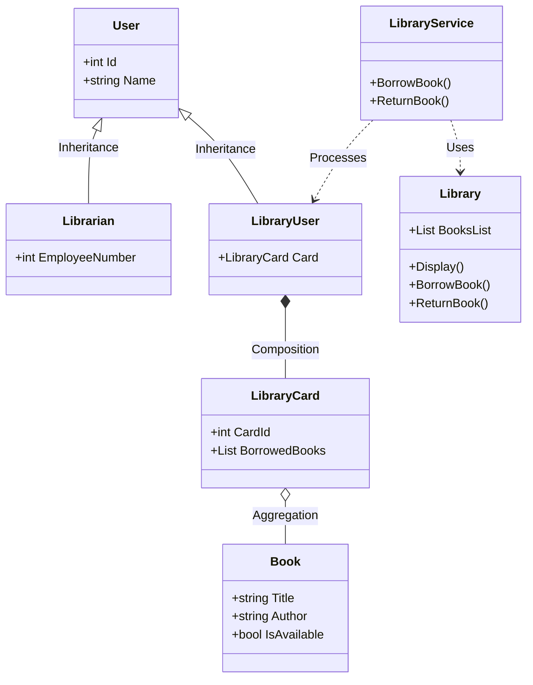

# 📚 Console Library Management System

A robust, enterprise-architected Console Application built with **C#** and **.NET**. This project showcases high-level proficiency in **Object-Oriented Programming (OOP)**, input validation defenses, dynamic memory architectures, and fluent string algorithms.

---

## 📐 System Architecture & OOP Principles

This system follows a clean **Service-Oriented Design**, strictly decoupling the Presentation Layer (UI) from the Core Business Logic.

### 🧠 Core OOP Implementation:
 * **Abstraction & Inheritance:** The abstract class User acts as the secure foundational blueprint for both Librarian and LibraryUser.
 * **Composition (Has-A Relationship):** A LibraryUser strictly *has a* LibraryCard. The card instance lifecycle is bound directly to the user.
 * **Encapsulation & Service Layer:** Complete protection of internal state; all domain actions are safely contained within the LibraryService layer.
## 🛡️ The Engineering Journey: Challenges & Solutions
Building this project wasn't just about writing syntax; it was a battle against typical runtime pitfalls:
### 1. The Application State & Memory Lifecycle
 * **The Challenge:** While cycling between roles, the program initially exited the runtime context, resetting the volatile static collections. Books would completely vanish.
 * **The Engineering Solution:** Encapsulated the entire role-selection framework inside a resilient while (true) event loop, keeping the process active and memory persistent across roles.
### 2. Guarding Against NullReferenceException
 * **The Challenge:** Attempting to append borrowed books to the user's collection crashed the environment because user.Card.BorrowedBooks evaluated as null.
 * **The Engineering Solution:** Implemented greedy constructor instantiation inside LibraryCard (BorrowedBooks = new List<Book>();), enforcing structural integrity.
### 3. Defending the Runtime Environment
 * **The Challenge:** Direct reliance on Convert.ToInt32() triggered severe crashes whenever a user typed letters into numeric menus.
 * **The Engineering Solution:** Replaced unstable typecasting with the conditional **int.TryParse()** framework paired with an isolated iterative query flow.
### 4. Search Rigidity & String Normalization
 * **The Challenge:** Exact equality matches forced users to guess the precise case and spacing of book titles.
 * **The Engineering Solution:** Re-engineered the matching system utilizing fluent string chaining (.ToLower().Trim()) and replaced absolute matches with **.Contains()**.
## 🚀 Future Roadmap (.NET Backend Transformation)
 * [ ] **Phase 1:** Configure a relational **SQL Server Database**.
 * [ ] **Phase 2:** Inject **Entity Framework Core (EF Core)** for ORM.
 * [ ] **Phase 3:** Port logic into a modern **ASP.NET Core Web API** utilizing RESTful patterns.

